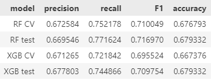
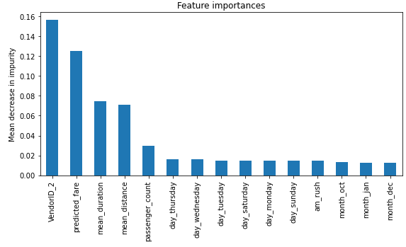

# 2017-Yellow-Taxi-Trip-in-NYC-Data-table-analysis-
The data was gathered by the New York City Taxi &amp; Limousine Commission in order to improve the learning experience and shorten runtimes, also to predict if a customer will not leave a tip.

## Overview 

Our aim with this project was to build predictive models using both Random Forest and gradient boosted decision trees "XGB" techniques with cross validation to figure out if a taxi passenger was likely to leave a generous tip or not. We gathered data from yellow taxi rides in New York City during the year 2017. The end result was our random forest model which achieved an accuracy of 67% and a precision of 67% and XGB model which achieved an accuracy of 66% and a precision of 67%. This model helped us identify which factors were the most crucial in distinguishing between passengers who tipped well and those who didn't. According to our findings, factors such as the predicted fare, the mean duration, the mean distance and others that had the most significant influence on whether a passenger would leave a generous tip or not.

## Business Understanding 

According to "salary.com" the average annualy salary for a New York Taxi Driver is around $45,000, This salary is significantly low that's why it's better to understand what are the factors that makes a client leave a generous tip or not in order to raise the driver salary.

## Data Understanding

This project used a dataset called "2017_Yellow_Taxi_Trip_Data.csv." merged with "nyc_preds_means.csv" 
The data in "2017_Yellow_Taxi_Trip_Data.csv" was gathered by the New York City Taxi & Limousine Commission and published by the city of New York as part of their NYC Open Data program.
Refer to [NYC taxi dataset](https://data.cityofnewyork.us/Transportation/2017-Yellow-Taxi-Trip-Data/biws-g3hs) for more informations.

## Modeling and Evaluation

A Random Forest and XGB models were used in this project, scores of both models are below.

Also feature importances are shown below.

##Conclusion

Both of the employed models served the purpose of identifying key factors that influence whether a client chooses to leave a tip or not. These findings can provide valuable insights for the company, allowing them to concentrate their efforts on enhancing the factors that increase the likelihood of a client leaving a gratuity.
